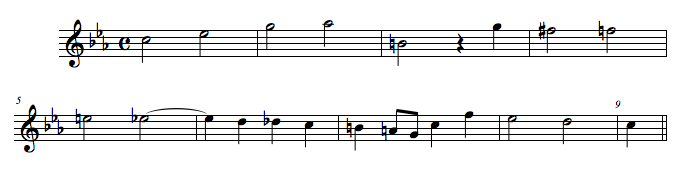

# Chương Giới Thiệu: Một Tặng Phẩm Âm Nhạc-Lôgíc

*Author*:

Frederick Đại Đế, hoàng đế của vương quốc Phổ, chiếm được quyền lực trong năm 1740. Mặc dù ông ta được nhớ đến trong các sách lịch sử chủ yếu nhờ vào tài năng quân sự, ông ta cũng tận tâm với đời sống tinh thần và tâm linh. Cung điện vương quốc Phổ ở Postdam là một trong những trung tâm lớn về những hoạt động trí tuệ ở Châu Âu trong thế kỷ mười tám. Nhà toán học lừng danh Leonhard Euler đã trải qua hai mươi lăm năm ở đó. Nhiều nhà toán học, nhà khoa học khác, cùng với các triết gia - bao gồm Voltaire và La Mettrie, những người đã viết nên các tác phẩm ảnh hưởng nhất của mình ở đó.

Nhưng âm nhạc mới là tình yêu thực sự của Frederick. Ông ta đã từng là một người thổi sáo và nhà soạn nhạc đầy khát vọng. Một vài tác phẩm của ông ấy thậm chí đôi khi còn được trình diễn đến ngày nay. Frederick là một trong những người bảo trợ đầu tiên cho nghệ thuật để công nhận sự tính hấp dẫn của đàn dương cầm mới được phát triển "piano-forte" ("soft-loud") (1). Đàn dương cầm được phát triển vào đầu thế kỷ mười tám như là một phiên bản cải tiến của đàn hardsichord. Vấn đề của đàn hardsichord là những bản nhạc chỉ có thể được chơi tại một cường độ khá đơn điệu - không có cách nào đánh một nốt lớn hơn những nốt cạnh nó. Sự "soft-loud", như tên gọi ngụ ý, đưa ra một cách bù đắp cho vấn đề này. Từ nước Ý, nơi Bartolomeo Cristofori đã chế tạo ra cái đầu tiên, ý tưởng soft-loud đã được truyền bá rộng rãi. Gottfried Silbermann, người đã chế tạo ra đàn organ lỗi lạc ngày đó, đang gắng sức để tạo ra một cây đàn piano-forte hoàn hảo nhất. Không còn nghi ngờ gì chính hoàng đế Frederick là một người ủng hộ lớn nhất cho nỗ lực này - tương truyền rằng hoàng đế đã sở hữu đến mười lăm cây đàn piano Silbermann!

## Bach

Frederick không chỉ là hâm mộ piano, mà còn là một người say mê nhà soạn nhạc và nhạc công đàn organ J. S. Bach. Những tác phẩm này của Bach có chút tai tiếng. Một vài người còn gọi chúng là "lằng nhằng và rối rắm", trong khi những người khác tuyên bố rằng chúng là những kiệt tác không thể sánh được. Nhưng không ai bàn cãi về khả năng ứng biến của Bach với đàn organ. Trong những ngày đó, một nhạc công đàn organ không chỉ có nghĩa là có khả năng chơi đàn, mà còn có khả năng biểu diễn ứng biến, và Bach được biết đến rộng khắp về khả năng ứng biến khác thường của mình. (Xem những giai thoại thú vị về khả năng ứng biến của Bach trong quyển The Bach Reader, bởi H. T. David và A. Mendel.)

Vào năm 1747, Bach tròn 62 tuổi, và sự nổi tiếng của ông ấy, cũng như một trong những người con của ông ấy, đã lan truyền đến Postdam; thực tế thì, Carl Philipp Emanuel Bach là nhạc trưởng trong cung điện của hoàng đế Frederick. Trong hàng năm trời, vua Frederick đã biết chắc rằng, thông qua những gợi ý lịch sự đến Philipp Emanuel, là sẽ vô cùng hài lòng nếu ông ấy có thể mời được Bach cha đến gặp ông ta; nhưng điều mong mỏi này đã không bao giờ thành hiện thực. Nhà vua Frederick đặc biệt khao khát muốn Bach thử những cây đàn piano của ông ta, thứ mà nhà vua thấy trước được có thể tạo ra một trào lưu vĩ đại mới trong âm nhạc.

Frederick có một phong tục tổ chức những buổi hoà nhạc thính phòng vào buổi chiều trong cung điện của mình. Thường thì nhà vua là nghệ sĩ độc tấu một bản hoà nhạc chơi bằng sáo. Đến đây thì chúng ta đã tái hiện lại được một bức tranh mô tả một buổi tối như thế bởi hoạ sĩ người Đức Adolph vol Menzel, người mà, trong những năm 1800, đã vẽ một chuỗi những bức hoạ mô tả lại cuộc sống của Frederick Đại Đế. Đang chơi đàn clavico chính là C. P. E. Bach, nhân vật xa nhất phía bên phải chính là Joachim Quantz, thầy dạy sáo của nhà vua - là người duy nhất được phép tìm ra lỗi khi nhà vua trình diễn. Một chiều tháng năm năm 1747, một vị khác không mời xuất hiện. Johann Nikolaus Forkel, một trong những người viết tiểu sử đầu tiên của Bach, kể một câu chuyện như sau:

> Một buổi chiều, ngay khi nhà vua đang chuẩn bị chơi sáo, và các nhạc sĩ của ông ấy đã nhóm họp, một cận thần đem tới chỗ ông ta một danh sách những người lạ vừa mới đến. Với cây sáo trên tay ông ta duyệt qua danh sách, ngay lập tức quay qua những nhạc sĩ, và nói, với một kiểu xúc động, "Quý vị, Bach cha đã đến." Cây sáo bây giờ được đặt sang một bên, và Bach cha, vừa ngồi xuống chỗ của con trai mình, vừa được triệu hồi đến cung điện. Wilhelm Friedemann, người hộ tống cha mình, đã kể cho tôi câu chuyện này, và tôi phải nói rằng tôi vẫn nghĩ với một niềm vui về cách mà anh ấy liên quan. Tại thời điểm đó nó là một kiểu khen tặng khá là rườm rà. Sự xuất hiện lần đầu tiên của J. S. Bach trước một vị vua vĩ đại, nhà vua thậm chí không cho ông thời gian để thay trang phục du lịch bằng một chiếc áo choàng đen, buộc phải có mặt với nhiều lời cáo lỗi. Tôi không đào sâu vào những lời cáo lỗi này, nhưng theo những lời từ Wilhelm Friedemann thì họ đã có một cuộc đối thoại chính thức với nhà vua.
Nhưng điều quan trọng hơn là nhà vua đã hoãn lại buổi hoà nhạc chiều, và mời Bach, giờ đây được gọi là Bach cha (Old Bach), thử chơi pianoforte, chế tạo bởi Silbermann, được đặt ở nhiều nơi khắp cung điện. [Forkel chèn vào đây lời chú dẫn: "Đàn pianoforte được chế tạo bởi Silbermann, từ Freyberg, rất được lòng nhà vua, nhà vua đã định mua hết tất cả. Ông ta đã sưu tập được mười lăm cây đàn. Tôi nghe rằng tất cả chúng đã không còn phù hợp để sử dụng nằm trong nhiều góc khác nhau ở cung điện hoàng gia."]. Các nhạc sĩ đi với nhà vua từ phòng này qua phòng khác, và ở chỗ nào Bach cũng được mời chơi thử những bản nhạc không chuẩn bị trước. Sau khi đã đi được một lúc, ông ấy đề nghị nhà vua cho ông ấy một chủ đề cho một bản đối âm (Fugue)(2), có thể được trình diễn ngay lập tức mà không cần sự chuẩn bị trước. Nhà vua ngưỡng mộ phương pháp vừa học được trong đó chủ đề của ông được trình diễn một cách ngẫu hứng; và, chắc có lẽ để thấy được loại hình nghệ thuật này có thể đi xa đến mức nào, nhà vua thể hiện nguyện vọng nghe một bản Fugue với sáu phần Obbligato(3). Nhưng bởi vì không phải chủ đề nào cũng phù hợp cho một dàn nhạc hoàn chỉnh như thế, Bach tự chọn một chủ đề để chơi trước sự kinh ngạc của tất cả quan khách hiện diện trong cùng một sự tráng lệ và phong thái như ông ấy đã trình diễn cho nhà vua. Bệ hạ của ông ấy cũng khao khát muốn xem ông ấy trình diễn đàn organ. Do đó ngày hôm sau Bach được đem đi đến tất cả đàn organ ở Postdam, giống như ông ấy đã từng trải nghiệm với đàn pianoforte của Silbermann. Sau khi trở về Leipzig, ông ấy sáng tác một chủ đề mà ông ấy vừa nhận được từ nhà vua, trong ba và sáu phần, thêm vào đó một vài đoạn nhân tạo trong một ca-nông chặt chẽ (canon)(4), đem đi chạm khắc nó, dưới một tiêu đề "Musikalisches Opfer" [Tặng Phẩm Âm Nhạc] và hiến dâng nó cho đấng sáng tạo.

FIGURE 2. Flute Concert in Sanssouci, by Adolph_Menzel (1852)

FIGURE 3. The Royal Theme

(1) soft-loud : giai điệu nhẹ nhàng - âm vang

(2) Fugue : Nhà soạn nhạc Johann Sebastian Bach là một bậc thầy về nghệ thuật đối âm – một kĩ thuật sáng tác chồng 2 giai điệu độc lập với ý nghĩa âm nhạc riêng lên nhau một cách hài hoà. Ông còn giỏi hơn ở hình thức fugue, một hình thức âm nhạc đối âm phức điệu đỉnh cao rất phức tạp. Fugue có thể được xem như một cuộc rượt đuổi âm nhạc giữa 2 – 3 bè khác nhau. Bè thứ nhất bắt đầu với một chủ đề; vài giây sau, bè thứ hai xuất hiện với chính chủ đề đó nhưng có thể thấp hơn hoặc cao hơn. Sau đó, có thể có sự xuất hiện của bè thứ ba và thứ tư. Thể loại này đòi hỏi nhà soạn nhạc phải có kĩ năng phát triển mỗi bè một cách độc lập nhưng vẫn có được một tổng thể hài hoà với những tương tác giữa các bè, thể hiện rõ được rằng mỗi bè tạo ra những biến tấu từ những bè đi trước. Khả năng chơi organ của Bach còn cho phép ông có thể ứng tấu một bản fugue 4 bè.

(3) Obbligato : 

(4) Canon : Trong lĩnh vực âm nhạc, canon là một bản nhạc đối âm sử dụng giai điệu có kết hợp một hoặc nhiều giai điệu phỏng mẫu kèm theo trong một khoảng thời gian nhất định (ví dụ, trong khoảng nghỉ, điệu nhảy) 

Khi Bach gửi một bản sao chép tác phẩm [Tặng Phẩm Âm Nhạc] (Musical Offering) tới nhà vua, ông ấy đính kèm theo một bức thư đề tặng, khá là thú vị cho phong cách văn xuôi của nó - chứ không phục tùng và tâng bốc. Từ góc nhìn hiện đại, chúng dường như khá tức cười. Hơn nữa, nó chắc có lẽ cũng thay cho lời xin lỗi của Bach về sự xuất hiện không được chỉnh chu trước đó.

> KÍNH THƯA ĐỨC VUA NHÂN TỪ!
Với sự khiêm tốn cao nhất, thần xin dâng lên Bệ Hạ một tặng phẩm âm nhạc, phần tráng lệ nhất của nó kế thừa từ chính bàn tay mạnh mẽ của Ngài. Thần rất hài lòng khi nhớ lại sự ân sủng rất đặc biệt từ hoàng gia trước đây, trong cuộc viếng thăm của thần đến Postdam, Bệ Hạ đã chiếu cố trình diễn cho thần nghe một bản nhạc trên đàn clavier, và cùng thời điểm đó điều này đã tiếp sức cho thần để thần trình diễn lại cho Bệ Hạ. Tuân theo mệnh lệnh của Bệ Hạ là một sự khiêm nhường nhất của thần. Tuy nhiên, thần đã sớm nhận ra, vì thiếu sự chuẩn bị cần thiết nên đã thi hành nhiệm vụ không thành công cho tương xứng với sự đòi hỏi của một chủ đề xuất sắc như vậy. Do đó thần quyết tâm và nhanh chóng tự cam kết sáng tạo ra đoạn nhạc mang chủ đề Hoàng Gia (Figure 3 - Royal Theme) này một cách đầy đủ hơn, và sau đó cho cả Thế Giới biết đến nó. Sự quyết tâm này hiện đã được trình diễn ngay khi có thể, và nó không có gì khác ngoài ý định không thể chê trách được, là để tôn vinh, nói ngắn gọn, là sự nổi tiếng của một vị quân vương vĩ đại và quyền lực, giống như trong tất cả các môn khoa học về chiến tranh và hòa bình, đặc biệt là trong âm nhạc, mọi người đều phải ngưỡng mộ và tôn kính. Thần xin táo bạo thêm một yêu cầu khiêm nhường này: mong Bệ Hạ chiếu cố chấp nhận món quà này như một thành quả lao động khiêm tốn nhất của thần.
> Kính Bệ Hạ,
> Thần dân khiêm tốn nhất của ngài,
TÁC GIẢ
Leipzig, July 7 1747

Hai mươi bảy năm sau, khi Bach đã qua đời được hai mươi năm, một Nam tước tên là Gottfried van Swieten - người mà, một cách tình cờ, Forkel đã dâng tiểu sử về Bach đến, và Beethoven dành tặng Bản giao hưởng đầu tiên của mình - đã nói chuyện với Vua Frederick, mà ông ta đã nói lại như sau:

> Nhà vua [Frederick] đã nói chuyện với tôi, ngoài một số những việc khác ra, là về âm nhạc, đặc biệt là âm nhạc của một nhà organ vĩ đại tên là Bach, người đã từng ở Berlin một thời gian. Người nghệ sĩ này [Wilhelm Friedemann Bach] được trời phú cho một tài năng vượt trội, sự sâu sắc của kiến thức hài hòa và sức mạnh của sự thực thi, với bất kỳ ai từng nghe nói đến hoặc có thể tưởng tượng được, trong khi đó những người biết cha của ông ấy còn cho rằng, Bach cha thậm chí còn tuyệt vời hơn. Đó là ý kiến của nhà vua, và để chứng minh cho tôi thấy, nhà vua đã hát to một bản chủ đề đối âm đầy màu sắc mà ông ta đã đưa cho ông già Bach này, người mà ngay tại chỗ đã biến tấu nó thành một bản đối âm bốn phần, sau đó là năm phần, và cuối cùng là tám phần.
